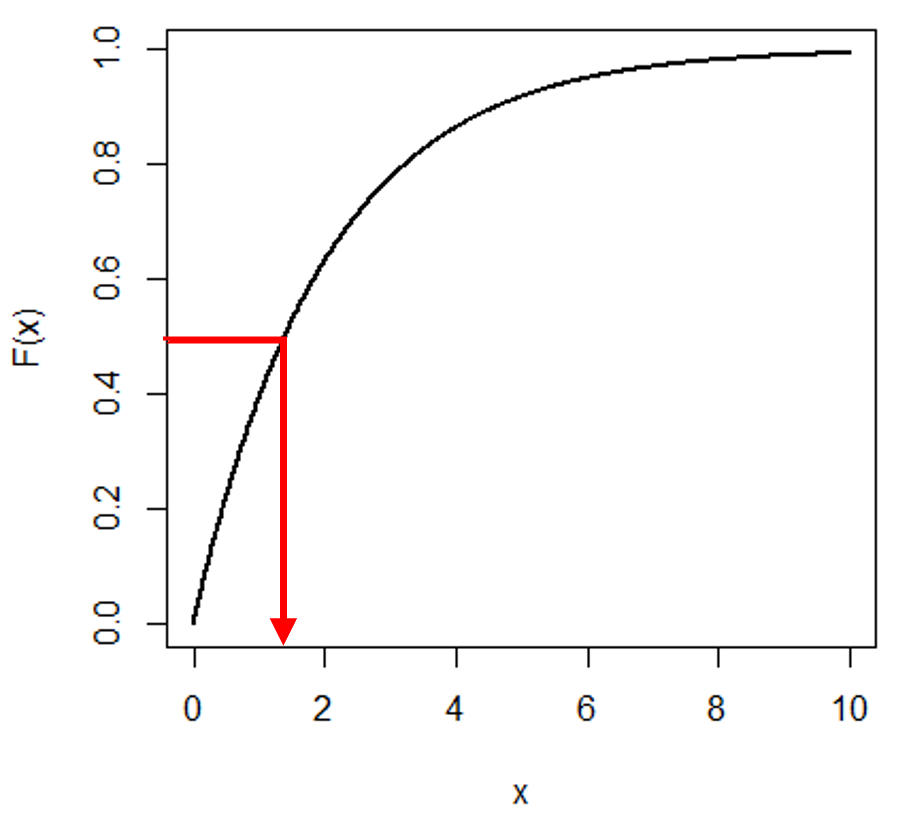

## 1. 분위수의 정의  
  
분위수는 모집단이나 표본의 전체 돗수를 크기 순으로 p등분시키는 (p-1)개의 등분값을 말한다. 만약에 우리가 어떤 확률 분포의 CDF(Cumulative Distribution Function)를 알면 분위수를 쉽게 구할 수 있다. CDF의 역함수가 분위수이기 때문이다. 아래의 그림을 보면 직관적으로 이해할 수 있다. 확률 분포를 전구간 적분하면 1이므로 CDF의 범위는 0부터 1을 가지고, CDF의 역함수를 취하면 해당 y값에 해당하는 x값이 분위수이기 때문이다.  

  
## 2.
하지만 어떤 확률분포의 CDF를 모르면 어떻게 할까? 이럴 때 우리는 순서통계량을 이용할 수 있다. 어떤 확률분포 $\{X_1, X_2, ..., X_n\}$ 의 순서통계량을 $\{X_{(1)}, X_{(2)}, ..., X_{(n)}\}$라고 하면, 우리는 분위수를 아래와 같이 표현할 수 있다.  

$$
\gamma = (np+m) - \left \lfloor np+m \right \rfloor (0 \leq \gamma \leq 1)\\
$$

여기서 **n=표본수**, **p=구하고자 하는 분위수**, **m=임의의 상수**로 정의하면 우리는 분위수 함수를 아래와 같이 표현할 수 있다.

$$
Q(p) = (1-\gamma) X_{(j)} + \gamma X_{(j+1)}\\
$$

$$
\frac{j-m}{n} \leq p \leq \frac{j-m+1}{n}
$$

---
**[후기]**  
  
1학기 시뮬레이션 수업 때 했던 논문 리뷰를 다시 정리해서 올린다. 이전까지는 '분위수가 그냥 분위수지....'라는 단순한 생각을 가지고 있었는데, 이 논문을 리뷰하면서 분위수를 구하는 방법이 무려 9가지나 존재했다는 걸 알게 되었다. R에서 quantile 함수를 쓸 때 type 옵션이 있는 줄도 모르고 무턱대고 썼는데 역시 세상은 넓고 내가 모르는 것 투성이다.  
  
---
**[Reference]**  
  
허윤숙. (2017). 지수 분포를 따르는 자료의 분위수 계산 방법 비교. 동국대학교 석사학위논문  
Langford, E. (2006). Quartiles in Elementary Statistics, URL: http://www.amstat.org/publications/jse/v14n3/ langford.html.  
Hyndman, R. J., and Fan, Y. (1996). Sample quantiles in statistical packages, American Statistician, Vol.50 No.4 pp.361-365